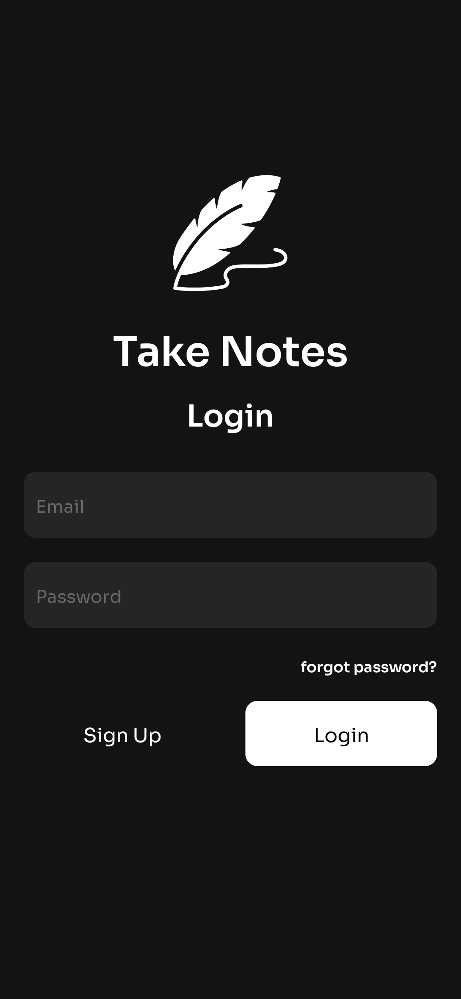
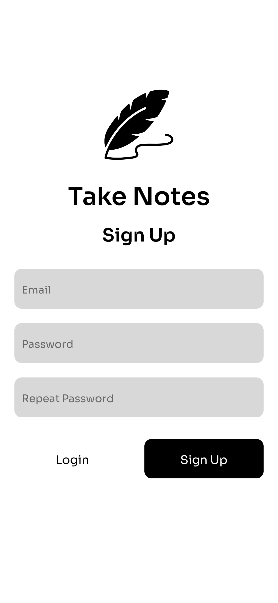
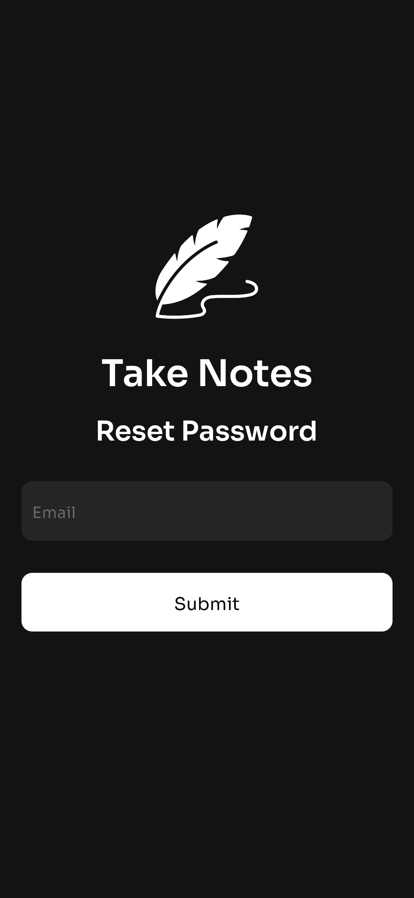
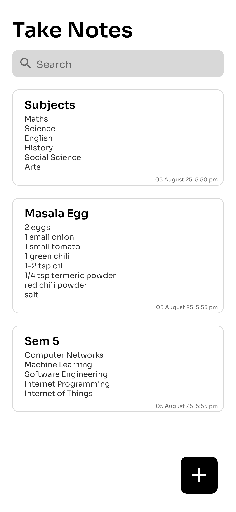
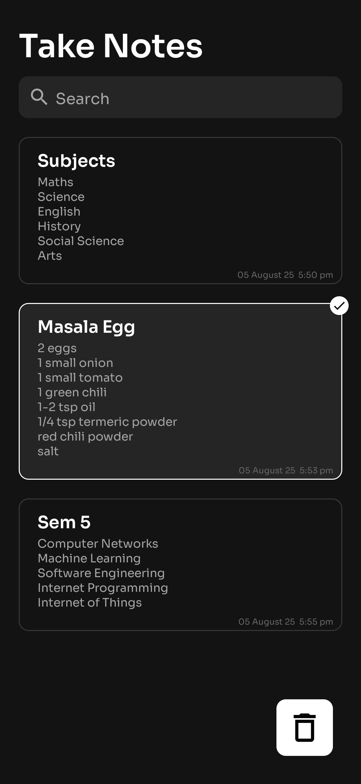
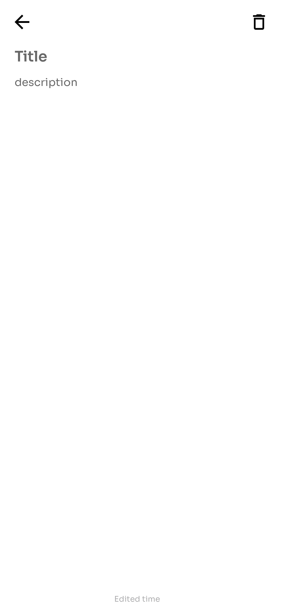
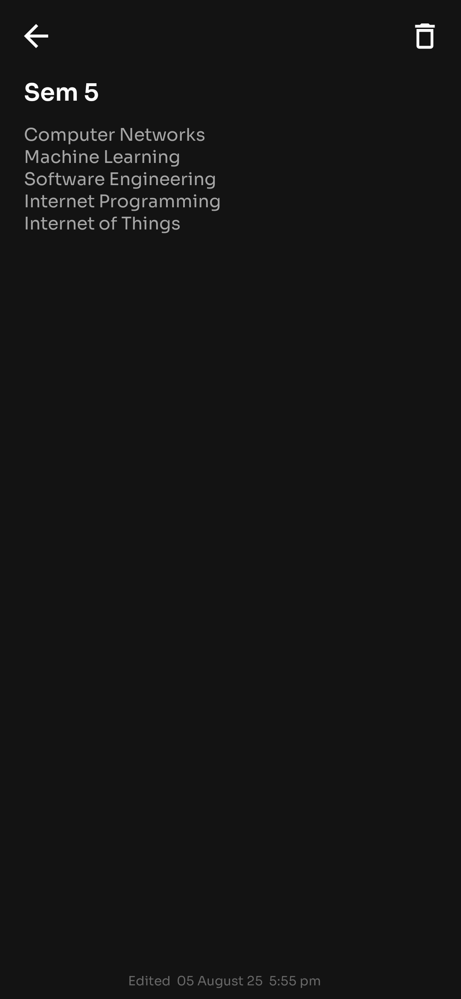
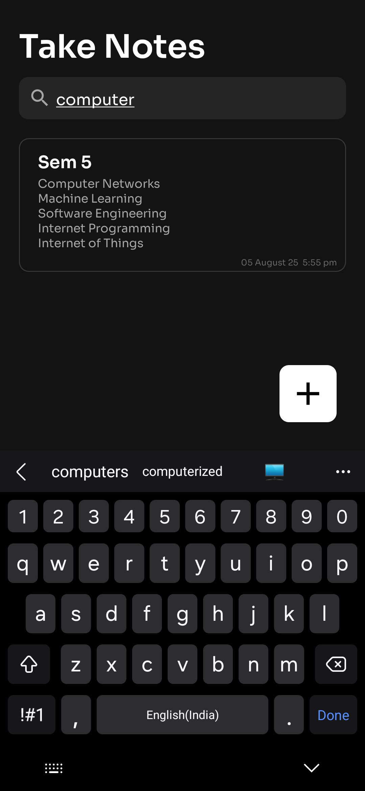
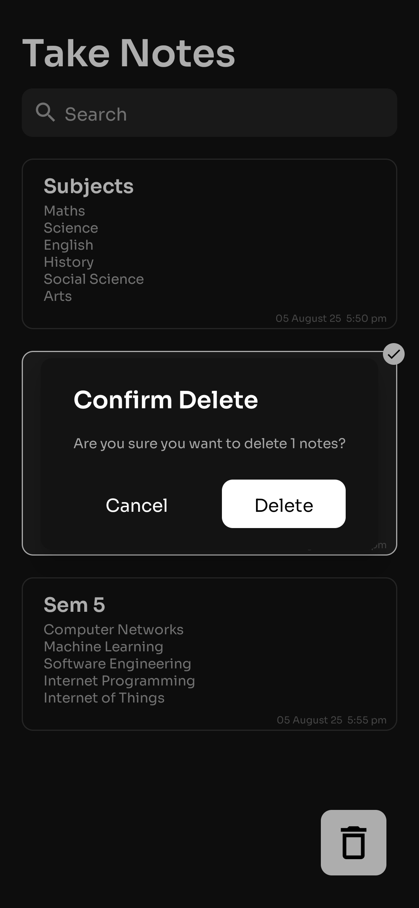

# 📝 Simple Notes App

A Simple Android Notes App with **Firebase integration** for login, signup, and Cloud Storage. Supports **real-time syncing**, **search**, and **light/dark mode**.

---

## ✨ Features

- 🔐 Login, Signup, and Forgot Password with Firebase Authentication
- 🗒️ Create, Edit, and Delete Notes
- 🔍 Search notes instantly by title or description
- 🌓 Light & Dark Mode with a clean, modern UI
- ⏳ Shows last edited date for every note
- 📁 Firebase Firestore integration for secure cloud storage

---

## 📸 Screenshots

### 🔑 Authentication (Light & Dark Mode)
<p align="center">
  
  
  
</p>

### 📄 Notes Screen (Light & Dark Mode)
<p align="center">
  
  
</p>

### 🖊️ Creating & Editing Notes
<p align="center">
  
  
</p>

### 🗑️ Search & Delete
<p align="center">
  
  
</p>

---

## 🔧 Tech Stack

- **Android Studio** (Kotlin)
- **Firebase Authentication** (Login/Signup/Reset)
- **Firebase Firestore** (Cloud Notes Storage)
- **Material Design** (Light/Dark Themes)

---

## 🚀 Getting Started

1. **Clone the repository**
   ```bash
   git clone https://github.com/sarthaktodmal/Simple-Notes-App.git
   cd simple-notes-app
2. **Add Firebase Config**
*   Create a Firebase project
*   Download google-services.json
*   Place it in app/ directory (this file is ignored in .gitignore for security)
3. **Run the app**
* Open in Android Studio
* Sync Gradle
* Run ▶️

## END